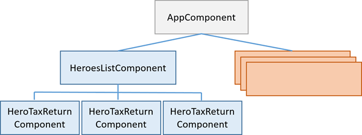

### Dependency Injection

#### The Dependency Injection pattern

본문은 DI 패턴에 대한 자세한 설명으로 이루어져 있다. 요약하자면 아래와 같다.

앵귤러는 DI 패턴을 기반으로 만들어져 있다. DI 패턴을 사용하게 되면 객체간의 결합도를 줄여주고, 테스트를 좀 더 명확하게 할 수 있다. 아래의 글을 참고해 보자

http://blog.jeonghwan.net/js/2017/02/17/dependency-injection.html
https://angular.io/guide/dependency-injection-pattern

#### Angular Dependency Injection

#### Injectable

`@Injectable` 데코레이터를 사용해서 클래스를 의존성 주입에 사용할 수 있게 한다. 

```js
import { Injectable } from '@angular/core';
import { HEROES }     from './mock-heroes';

@Injectable({
  // we declare that this service should be created
  // by the root application injector.

  providedIn: 'root',
})
export class HeroService {
  getHeroes() { return HEROES; }
}
```

#### Injectors

`@Injectable` 데코레이터를 사용한 서비스(클래스)라도 어디서 어떻게 이 서비스를 사용하고 생성할지를 알려줘야 한다. `Provider`를 사용해서 이러한 설정을 할 수 있고, 여러가지 방법으로 Provider를 설정할 수 있다.

#### @Injectable providers

```js
import { Injectable } from '@angular/core';

@Injectable({
  providedIn: 'root',
})
export class HeroService {
  constructor() { }
}
```

`@Injectable` 데코레이터는 어떠한 서비스를 주입할 것인지, 혹은 어디에 주입해야할지를 알아볼 수 있게 한다. `providedIn`이라는 속성을 통해서 앵귤러에게 어떤 인젝터가 서비스를 생성할지를 정하게 된다. `lazily-loaded context`와 같은 상황에서는 굳이 root Injector에서 주입할 필요가 없기 때문에, 인젝터를 따로 설정할 수도 있다.

##### @NgModule providers

모듈 파일에서 `providers`를 설정할 수 있다.

##### @Component providers

컴포넌트에서도 `providers`를 설정할 수 있다.

##### @Injectable, @NgModule or @Component?

서비스의 `provider`를 어떻게 설정할지에 대해서는 번들 사이즈와 서비스 스코프 그리고 서비스의 라이프타임에 따라 달라진다. 

`@Injectable` 데코레이터를 사용하게 되면 필요 없는 서비스를 트리쉐이킹 작업에서 제거할 수 있게 되어서 번들 사이즈를 줄일 수 있다.

Angular module providers에서 root injector를 사용해서 등록할 경우, 하나의 인스턴스로 모든 앱에서 해당 서비스를 사용할 수 있게 된다. 이때 모든 앱에서 하나의 인스턴스를 공유하게 된다.

> To be precise, Angular module providers are registered with the root injector unless the module is lazy loaded. In this sample, all modules are eagerly loaded when the application starts, so all module providers are registered with the app's root injector.

Component's provider를 사용할 경우, 서비스의 lifetime이 컴포넌트의 lifetime과 동일하게 된다. 즉 컴포넌트가 destroy되면 서비스도 destroy된다.

#### Providers

인젝터는 providers에 의존해서 서비스를 생성하게 된다. 반드시 providers에 서비스를 등록해야 서비스를 생성할 수 있다.

```js
providers: [Logger]
```

보통 위와같은 방법으로 서비스를 등록하게 된다. 위 방법은 가장 기본적인 방법이고 다양한 방법으로 provider를 설정할 수 있다.

##### The provide object literal

```js
providers: [Logger]
```

```js
[{ provide: Logger, useClass: Logger }]
```

위 방법은 아래방법의 shorthand expression 방식이다. 첫번째 프로퍼티는 provider에 등록할 key이고 두번째는 실제로 어떠한 클래스를 사용해서 그 서비스를 만들지에 대한 프로퍼티 이다.

###### Alternative class providers

```js
[{ provide: Logger, useClass: BetterLogger }]
```

만약 동일한 이름의 서비스로 등록하고 싶지만 다른 클래스를 사용해서 만들고 싶다면 위와 같이 등록하면 된다.

###### Aliased class providers

만약 `OldLogger`라는 서비스에 의존성이 있는 컴포넌트에서 코드를 수정하지 않고 `OldLogger` 대신 `NewLogger`라는 서비스를 사용하려면 아래와 같이 설정할 수 있다. 

```js
[ NewLogger,
  // Alias OldLogger w/ reference to NewLogger
  { provide: OldLogger, useExisting: NewLogger}]
```

```js
[ NewLogger,
  // Not aliased! Creates two instances of `NewLogger`
  { provide: OldLogger, useClass: NewLogger}]
```

위와 같은 방법은 두개의 인스턴스를 만들기 때문에 적절한 방법이 아니다.

##### Value providers

```js
// An object in the shape of the logger service
export function SilentLoggerFn() {}

const silentLogger = {
  logs: ['Silent logger says "Shhhhh!". Provided via "useValue"'],
  log: SilentLoggerFn
};

[{ provide: Logger, useValue: silentLogger }]
```

위와 같은 방법으로 class의 인스턴스 말고도, 단순 오브젝트도 의존성 주입을 할 수 있게된다.

#### Factory providers

의존성이 있는 값을 동적으로 결정하기 위해서는 factory provider라는 방식을 사용한다. 예를 들어서 설명해보자. 만약 `HeroService`가 secret heroes를 일반 유저에서 숨기고 권한이 있는 유저에게만 볼 수 있게 하려면 단순히 `HeroService`에게 `UserService`를 주입할 수 없다. `HeroService`는 `UserService`에 직접적으로 접근할 수 없고 `boolean` 값을 생성자에서 받는다고 하자.

hero.service.ts (excerpt)
```js
constructor(
  private logger: Logger,
  private isAuthorized: boolean) { }

getHeroes() {
  let auth = this.isAuthorized ? 'authorized ' : 'unauthorized';
  this.logger.log(`Getting heroes for ${auth} user.`);
  return HEROES.filter(hero => this.isAuthorized || !hero.isSecret);
}
```

`Logger`를 주입할 수는 있지만 `isAuthorized`를 주입할 수 없다고 할때 factory provider를 사용해서 `HeroService`의 인스턴스를 생성해야 한다.

hero.service.provider.ts (exerpt)
```js
let heroServiceFactory = (logger: Logger, userService: UserService) => {
  return new HeroService(logger, userService.user.isAuthorized);
};

export let heroServiceProvider =
  { provide: HeroService,
    useFactory: heroServiceFactory,
    deps: [Logger, UserService]
  };
```

컴포넌트에서는 아래와 같이 사용할 수 있다.

```js
import { Component }          from '@angular/core';
import { heroServiceProvider } from './hero.service.provider';
 
@Component({
  selector: 'app-heroes',
  providers: [ heroServiceProvider ],
  template: `
    <h2>Heroes</h2>
    <app-hero-list></app-hero-list>
  `
})
export class HeroesComponent { }
```


#### Tree-shakable providers

Tree shaking은 어플리케이션에서 참조되지 않는 코드를 제거하는 능력이다. 이를 통해서 번들 사이즈를 유의미하게 줄일 수 있다. 이상적으로 만약 어플리케이션이 서비스를 주입하지 않는다면 번들에서 해당 코드는 포함되지 않아야 한다. 하지만 앵귤러의 빌드타임에서는 서비스가 필요한지 필요하지 않은지 알 수 없다. `injector.get(Service)`를 사용해서 어디서든지 서비스를 주입할 수 있기 때문에, 앵귤러에서는 해당 코드가 필요없는지 필요한지 알 수 없다. 모듈에서 provide 되는 서비스는 tree-shakable하지 않다.

###### Creating tree-shakable providers

tree-shakable한 provider를 만들기 위해서는 `@injectable` 데코레이터 안에 정보를 제공해야 한다. 

```js
@Injectable({
  providedIn: 'root',
})
export class Service {
}
```

위 예제에서는 `providedIn`이 서비스를 inject할 injector를 선언한 것이다. 특별한 경우가 아니면 이 값은 대부분 `root`이며 `root` 값으로 이 값을 설정하면, 이 서비스의 스코프는 root injector가 된다. 또한 모듈에서 따로 선언할 필요 없다.

또한 서비스는 factory function을 사용해서 초기화 될 수 있다.

#### singleton service

서비스는 injector의 스코프 안에서는 싱글톤이다. 루트 injector는 단 하나만 있으며, 만약 `UserService`가 루트 injector에 등록되어 있다면 전체 앱에서는 단 하나의 `UserService`만 존재한다. 또한 모든 클래스에서 `UserService`를 주입할 수 있다. 

하지만 Angular DI는 hierarchical injection system이기 때문에 중첩된 injectors에서 자신만의 service instance를 만들 수 있다.

#### Component child injectors

컴포넌트 injector는 각각이 분리되어 있다. 각각이 자신만의 component-provided 서비스를 만든다.

컴포넌트가 `@Component.providers`를 생성한다면, 이 컴포넌트는 자신만의 injector를 생성한다.

만약 앵귤러가 컴포넌트의 인스턴스를 제거한다면, 컴포넌트의 injector 역시 제거한다. 

`injector inheritance` 때문에, 어플리케이션 레벨에서의 서비스를 어떠한 컴포넌트에서도 주입할 수 있다. 컴포넌트의 injector는 부모 컴포넌트의 injector의 자손이고 이를 쭉 확장하게 되면 appliction의 root injector까지 올라가게 된다.

#### Testing the component

dependency injector은 클래스의 테스트를 더 쉽게 만든다. 의존성을 생성자의 인자로 나열하게 되면 어플리케이션의 테스트를 좀 더 효율적으로 할 수 있다.

#### When the service needs a service

서비스 역시도 dependency를 가질 수 있다. 만약 `HeroService`가 `Logging Service`에 의존성이 있다면 생성자에 `Logger` 인자를 추가해주면 된다.

```js
import { Injectable } from '@angular/core';
import { HEROES }     from './mock-heroes';
import { Logger }     from '../logger.service';

@Injectable({
  providedIn: 'root',
})
export class HeroService {

  constructor(private logger: Logger) {  }

  getHeroes() {
    this.logger.log('Getting heroes ...');
    return HEROES;
  }
}
```

##### The dependent Logger service

sample app의 `Logger` 서비스는 간단하게 구현할 수 있다.

```js
import { Injectable } from '@angular/core';

@Injectable()
export class Logger {
  logs: string[] = []; // capture logs for testing

  log(message: string) {
    this.logs.push(message);
    console.log(message);
  }
}
```

#### Dependency injection tokens

injector에 provider를 등록할때, dependency injection token과 결부된다. injector는 dependency를 요청받을때 참조하는 internal token provider map을 유지한다. 토큰은 맵에서 키로 쓰이게 된다. 이전 예제를 확인해보면, 의존성 값은 클래스에 인스턴스였고, 클래스 타입은 its own lookup key로 사용됬다. 

만약 너가 작성한 생성자가 injected class-based dependency가 요구된다면 편하게 사용할 수 있다. 예를 들어 생성자에서 HeroService 클래스 타입을 인자로 받으면, 앵귤러가 HeroService class token과 연계되어 있는 서비스를 주입하면 된다는 것을 알고 있기 때문에 쉽게 작성할 수 있다.

###### Non-class dependencies

만약 의존성이 있는 값이 class가 아니어도 문제 없이 작동한다.

특히 설정값이 작성되어 있는 오브젝트의 같은 경우가 대표적인데, 아래와 같이 작성할 수 있다.

```js
export const HERO_DI_CONFIG: AppConfig = {
  apiEndpoint: 'api.heroes.com',
  title: 'Dependency Injection'
};
```

타입스크립트의 interface는 injector의 토큰으로 사용할 수 없다.

##### InjectionToken

provider가 non-class dependencies를 사용할때 injectionToken을 사용해서 토큰을 정의할 수 있다. 아래를 참고해 보자

```js
import { InjectionToken } from '@angular/core';
export const TOKEN = new InjectionToken('desc');
```

프로바이더가 `injectionToken`을 생성할때 직접적으로 설정할 수 있다. 프로바이더 설정은 특정 인젝터가 어떤 값을 생성하게 할지 정할 수 있다. `@Injectable`을 사용하는 것과 비슷하지만, standard provider를 사용할 수 없다는 단점이 있다. 대신 팩토리 함수를 사용해서 값을 직접적으로 provide에게 전달할 수 있다.

```js
export const TOKEN = 
  new InjectionToken('desc', { providedIn: 'root', factory: () => new AppConfig(), })
```

이제 `TOKEN` 객체를 사용해서 설정값을 모든 생성자에 주입할 수 있다.

```js
constructor(@Inject(TOKEN));
```

만약 팩토리 함수가 DI tokens에 접근해야 해야 아래와 같이 구현할 수 있다. `inject()` 함수는 `@angular/core`에 있다.

```js
const TOKEN = 
  new InjectionToken('tree-shakeable token', 
    { providedIn: 'root', factory: () => 
        new AppConfig(inject(Parameter1), inject(Paremeter2)), });
```

#### Optional dependencies

만약 의존성 값이 optional 하다면 생성자에게 null인자를 넘겨줌으로써 해결할 수 있다

```
constructor(@Inject(Token, null));
```

#### Summary

앵귤러에서 다양한 provider를 등록할 수 있고 이 proivder에게 어떻게 객체나 서비스를 주입할 수 있을지 물어 볼 수 있게 된다. 

앵귤러의 의존성 주입은 가이드에서 서술한 것 보다사 다양하게 사용할 수 있다. Hierarchical Dependency Injection 섹션을 참고해보면 중첩 injectors에 대해서 알아보자.

#### Appendix: Working with injectors directly

아래를 참고하면 injector를 구현할 수 있다.

```js
@Component({
  selector: 'app-injectors',
  template: `
  <h2>Other Injections</h2>
  <div id="car">{{car.drive()}}</div>
  <div id="hero">{{hero.name}}</div>
  <div id="rodent">{{rodent}}</div>
  `,
  providers: [Car, Engine, Tires, heroServiceProvider, Logger]
})
export class InjectorComponent implements OnInit {
  car: Car;
 
  heroService: HeroService;
  hero: Hero;
 
  constructor(private injector: Injector) { }
 
  ngOnInit() {
    this.car = this.injector.get(Car);
    this.heroService = this.injector.get(HeroService);
    this.hero = this.heroService.getHeroes()[0];
  }
 
  get rodent() {
    let rousDontExist = `R.O.U.S.'s? I don't think they exist!`;
    return this.injector.get(ROUS, rousDontExist);
  }
}
```

`Injector`가 주입할 수 있는 서비스이다.

위 예제에서는 앵귤러는 컴포넌트에 자신의 `Injector`로 컴포넌트에 생성자에 주입할 수 있다. 컴포넌트는 주입된 injector에게 원하는 서비스를 `ngOnInit()`에서 요청하게 된다.

서비스는 자체가 컴포넌트에게 주입되는 것이 아니고 `injector.get()`를 요청함으로써 불려지는 것을 볼 수 있다.

만약 요청한 서비스를 resolve 할 수 없다면 `get()` 메서드는 에러를 던지게 된다. `get()`을 서비스를 찾을 수 없다면 값을 반환하는 함수와 함께 호출할 수 있다. 만약 앵귤러에 서비스가 등록되지 않았다면 서비스를 찾을 수 없다.

이 테크닉은 `service locator pattern`이라고 불린다

정말로 이 방법이 필요한 것이 아니라면 이 방법을 사용하지 않아야 한다. 이 방법은 부주의한 grab-bag 접근 방식을 부추기기 때문이다. 이 방법은 테스트거나, 이해하거나, 설명하기 어렵다. You can't know by inspecting the constructor what this class requires or what it will do. 자신에게서 서비스를 얻는게 아니라 서비스를 위쪽 조상 컴포넌트에서도 얻을 수 있다. 강제로 구현을 확인하지 않는 이상 이것이 무엇을 하고 있는지 알기 힘들다

아마 프레임워크 개발자는 반드시 특정 서비스를 일반적으로 혹은 동적으로 얻어야 할때 이 방법을 선택해야 한다.

### Hierarchical Dependency Injectors

앵귤러는 계층형 인젝션 시스템을 가지고 있다. 실제로 어플리케이션 컴포넌트 트리에 대응되는 injector 트리가 존재하고 이 트리를 컴포넌트에 어떤 레벨에서도 재설정할 수 있다.

#### Injector Tree

Dependency Injection 가이드에서 어떻게 의존성 주입을 어떻게 설정하고 어떻게 의존성을 다시 불러오는지 배웠다

사실 `the injector`는 존재하지 않는다. 어플리케이션은 여러개의 인젝터를 가질 수 있다. 앵귤러 어플리케이션은 컴포넌트의 트리이다. 각각의 컴포넌트 인스턴스는 자신의 injector를 가지고 있다. 컴포넌트 트리는 인젝터 트리와 평행하다.

> 컴포넌트 인젝터는 조상 injector의 `proxy`일 수도 있다. 이러한 구현의 디테일은 효율을 극대화 시킨다. 아마 차이점을 알아챌 수 없을 것이고 아마 각자의 컴포넌트가 각자의 injector를 가지고 있다고 생각할 것이다.

이 가이드를 Tour of Heroes 어플리케이션의 다른 버젼이라고 생각해보자. 가장 상위는 `AppComponent`이고 여러개의 서브 컴포넌트를 가지고 있다. HeroesListComponent는 서브 컴포넌트중 하나이다. HerosListComponent는 여러개의 `HeroTaxReturnComponent` 인스턴를 가지고 관리하고 있다. 아래 다이어그램은 이 가이드의 three level 컴포넌트를 표현하고 있다.





#### Injector Bubbling

컴포넌트가 의존성이 필요할때, 앵귤러는 의존성이 provider와 함께 그 컴포넌트의 injector에 등록되어 있게 하게 시도합니다. 만약 컴포넌트의 인젝터가 provider가 없다면, 부모 컴포넌트의 인젝터로 요청합니다. 만약 부모 컴포넌트에도 없다면 그 부모의 부모의 injector로 올라갑니다. 이 요청은 앵귤러가 그 요청을 처리하거나 혹은 injector를 모두 사용할때까지 반복됩니다. 만약 만족하는 injector가 없다면 앵귤러는 에러를 던집니다.

> 만약 중간에 컴포넌트가 `host` 컴포넌트인 것을 선언한다면, 이러한 버블링을 막을 수 있습니다. 이 요청은 더이상 위로 올라가지 않습니다.

###### Re-providing a service at different level

provider에 특정한 dependency token을 다양한 레벨의 인젝터 트리에서 다시 등록할 수 있습니다. provider에 새롭게 등록할 필요는 없고, 특별한 이유가 없다면 해서는 안됩니다.

As the resolution logic works upwards, 처음으로 마주친 provider가 이깁니다. 따라서 중간에 있는 injector의 provider가 service에 대한 요청을 가로챌 수 있습니다. 이건 효과적으로 높은 레벨의 있는 provider를 재설정할 수 있습니ㅏㄷ

만약 가장 높은 레벨의 provider만 특정하고 싶다면, injector 트리는 평평하게 될 것입니다. 모든 요청은 `bubble up`되어서 루트의 `NgMoudle` 인젝터까지 올라갈 것이고, 이 인젝터는 `bootstrapMoudle` 메서드를 설정하게 됩니다.

#### Component Injector

하나 이상의 provider를 다른 레벨에서 새롭게 설정할수 있는 기능은 다양하고 흥미로운 가능성을 열어줍니다.

##### Secenario: service isolation

아키텍쳐상의 이유로 서비스에 대한 접근을 응용프로그램의 도메인으로 한정지을 수 있습니다.

이 가이드 샘플은 `VillainsListComponent`로써 villan의 리스트를 보여줍니다. 빌런들은 `VillianService`에서 가져오게 됩니다

`VillanService`를 root에 `AppMoudle`에서 provider 할 동안은, `VillanService`는 어플리케이션의 모든 곳에서 사용할 수 있게 됩니다. 어플리케이션은 Hero workflows를 포함하고 있습니다.

만약 나중에 `VillainService`를 수정하게 된다면, 아마 hero Component의 일부분을 손상시킬 수 도 있습니다. 그런 일은 일어나지 않을 수도 잇지만, 만약 서비스를 root `AppMoudle`에서 제공하게 된다면 리스크가 포함됩니다.

대신 `VillianService`를 provider를 `VillainsListComponent`에 `providers` metadata에 명시할 수 있습니다.

```js
@Componenet({
  selector: 'app-villains-list',
  templateUrl: './villains-list.component.html',
  providers: [ VillainsService ],
})
```

`VillainService`를 `VillainsListComponent`의 metadata에서 제공하고, 다른곳에서 하지 않는다면 (providing) 이 서비스는 `VillainsListComponent` 혹은 이 컴포넌트의 서브 컴포넌트에서만 사용할 수 있게됩니다. 여전히 singleton이긴 하지만, `villain` 도메인에서만 존재하는 singleton입니다.

##### Scenario: multiple edit sessions

많은 어플리케이션에서 유저들이 여러개의 open tasks를 같은 시간에 다룰 수 있도록 허락합니다. 예를 들어 세금 준비 어플리케이션의 경우, 번갈아 가면서 한번에 여러개의 택스 리펀을 작업할 수 도 있습니다.

이 가이드는 위의 시나리오를 Tour of Heroes theme고 함께 보여줍니다. 바깥쪽 HeroListComponent가 super heroes의 목록을 보여준다고 생각해 봅시다.

hero's tax return을 열기 위해서는, 수정을 위한 컴포넌트를 반환하게 되어 있는 hero name을 클릭해야 합니다. 각각의 선택된 hero tax return은 자신의 컴포넌트를 열게 되고 그리고 여러개의 컴포넌트도 하번에 열릴 수 있습니다.

각각의 tax return 컴포넌트는 아래의 성격을 가지고 있습니다

- 자신만의 tax return editing session
- 다른 컴포넌트의 영향을 미치지 않고 tax return을 바꿀 수 있어야 한다.
- 변화된 값을 저장할 수 있거나 혹은 취소할 수 있는 기능